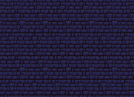

# Unity Game Development Summary

| Field | Detail |
|---|---|
| **Game Title** |Castle Jumper |
| **Student Name(s)** |D.O|
| **Class / Course** |10CT1 |
| **Repository** |2026CT_GameDesign_JumpKnight_Dan.O |
| **Unity Version** | 6000.0.58f1|
| **Document Version** |0.10 |
| **Date** |27/08/2026 |

---

## Table of Contents
1. [Game Overview](#1-game-overview)
2. [Video Walkthrough](#2-video-walkthrough)
3. [Game Mechanics](#3-game-mechanics)
4. [Visual Features](#4-visual-features)
5. [Audio Design](#5-audio-design)
6. [User Interface & HUD](#6-user-interface--hud)
7. [Scene & Level Design](#7-scene--level-design)
8. [Scripts & Programming](#8-scripts--programming)
9. [Development Techniques & Tutorials Acknowledged](#9-development-techniques--tutorials-acknowledged)
10. [Third-Party Content Acknowledgements](#10-third-party-content-acknowledgements)
11. [Challenges & Solutions](#11-challenges--solutions)
12. [Branch Development Summary](#12-branch-development-summary)

---

## 1. Game Overview

### 1.1 Genre
Platfrom-adventure/foddian game

### 1.2 Target Audience
People who have alot of free time and enjoy punishing gameplay. 

### 1.3 Game Summary
Castle jumper is a platfrom adventure game with elements of the foddian game. The player must traverse a castle playingthrough differnt level each with their own unique design and theme. As the player traverse up the castle they must attempt difficult jump and obstacals such as wide jumps and ice levels and if the player misses these jumps they will fall to the start of the level

### 1.4 Win / Loss Conditions
| Condition | Description |
|---|---|
| Win | Find the princess at the top |
| Loss | Fall down to the start of a level, fall to the start of the game, fall off the map|

### 1.5 Platform & Build Settings
| Setting | Detail |
|---|---|
| Target Platform | |
| Resolution | |
| Build Type | |

---

## 2. Video Walkthrough

### 2.1 Full Gameplay Walkthrough

<!--
  Embed a YouTube/Vimeo video or link to a file in the repository.
  YouTube embed syntax:
  

  OR link to a local file:
  [Watch Walkthrough Video](./docs/video/walkthrough.mp4)
-->

| Field | Detail |
|---|---|
| **Video Title** | |
| **Link / Embed** | |
| **Duration** | |
| **Description** | |

### 2.2 Feature Highlight Clips

| Clip | Description | Link |
|---|---|---|
| | | |
| | | |
| | | |

---

## 3. Game Mechanics

### 3.1 Core Mechanics
| ID | Mechanic | Description | Implemented In (Script/Object) |
|---|---|---|---|
| M-1 | Charge Jump| Castle jumpers gameplay is based of a charged jump, the player holds the jump button for up to 5 seconds for maximum height. When the player releases the jump button they are then propelled upwards or sideway depedning on their prevoise input. The player can also jump in almost any direction becuase the jump is based of momentum. | The jump is implemented in the player's movement script and mechanics : PlayerMovement.cs|

| M-2 | Boune back |  The Bounce back mechanic is pivitol on deciding how the player will interact with the levels and is a pivitol deciding factor that the player has to thnk about when planning thier jumps from platforms to platforms. Bounce back is also used to traverse levels with bounce back being needed to get paster obstacals and progress. he bounceback is a punishment tool for players who eaither over or underestimate thier jump. When a player has jumped and hits a wall or platfrom and do not make it to the next platfrom they will be bounced back with around a quater of the momentum that they released with this wil send them back either down levels or back onto a platforom  | The bounceback mechanic is implemented into the players movement script: PlayerMovement.cs |

| M-3 | Air movement | The core mechanics of castle jumpers is a platformer game, most games allow the player to move in the air when jumping, castle jumpers does not allow the player to control their movement when in air aswell as when launching off a jump. The lack of airmovement is the one of core gameplaymechanics that players need to grasp when playing. When the player holds the jump button then relases it and  is then launched in the air the player has no control while in the air and must estimate where they will end up. the player will also have some controle of momentum but the player can aim their jump and the byproduct of this is the player also must account for momentum when proceddding with jumps. |This air movement mechanic is located in  PlayerMovement.cs |

| M-4 | Fall punishment| Castle jumpers is designed to be a punishing game that forces the player to keep trying and perfect their jumps so they can continue making progress,  that is the way players learn and progress through the game but castle jumpers must have a punishment when failing  these jumps. The punishment of when a player fails a jump or overestimated how far they will reach and goes over the platfrom, the player fill fall until they can hit a new platform or until the player hits the bottom their are no checkpoints in the current game but if I were to implement one it would be a log platform that would cover move of the level, but I dont this I would do this.| SPIKE OBJECT |

| M-5 | Ice levels| Levels in castle jumpers vary between two differnt types of platforms the first on is normal levels and the second one is ice level, the normal platfroms act as a default platfrom as when the player land on them they have little to no momentum. This is differnt when the player lands on the ice platforms, the players momentum will carry over causing the player to keep moving one they have landed on the platfrom this causes the player to constanly provide an opposite movement force so the player does not fall off as well as making it harder to plan jumps and wall bounces. | My ice levels are in my movement script: PlayerMovement Script.cs|

### 3.2 Player Controls
| Action | Input (Keyboard / Controller) | Description |
|---|---|---|
| Jump| (Space / X) | Allows the player to launch in the air as well as charge jumps that go up to a certain height as well as provides momentum to the player once t he player hits or holds this button|
|Walk | (A / D) (Joystick left / Joystick right)| Moves the player in either a left or right direction provides the player with momentum when charging jumps as well as percision when aiming jumps.|
| | | |
| | | |

### 3.3 Physics & Collision
| Feature | Description |
|---|---|
| Ground Check | the players ground check using a little circle underneath the player called ground check and then casting a tiny circular detection area around that point.constantly check weather the player is sitting on solid ground. Unity checks whether this circle overlaps any collider on the designated ground layer. If it does, the player is considered grounded and if not the player is airborne.  |

| Bounce Back| The bounceback collion in my game is a system that bounces my player back a few units when hitting a wall and colliding with speed it works by detecting a side collision usually through contact points or raycasts and then instantly applying a horizontal velocity in the opposite direction, when the player hits a wall on the left the player is bounced back to the right, and when the player hits a wall on the right the player is bouned back to the left this physics also applies to the on the Y or Z when the player hits the top of the platform they are bounced back under. It works by detecting a side collision usually through contact points or raycast|

| Wall detection| Wall detection is part of my movement code that detects weather the player is collding with a wall it controls mechanics like the bounceback, wall sticking and prevents sliding, this works by firing two short raycasts one to the left and one to the right from the players position. If either raycast hits a collider on the ground layer, the script knows the player is touching a wall. Once a wall is detected the movement script reacts by stopping horizontal velocity, applying bounceback and preventing the player from sliding into corners because the raycasts are short and directional they only detect walls directly beside the player|

### 3.4 Game Loop
| Stage | Description |
|---|---|
| Start / Initialisation | The game begins in a menu with the the title screen, the name of the game: Castle Jumpers and two buttons one with start an one that says quit, if the plater hits start gmae. The game will start with the player being surronded by 2 big platforms the that the player must jump out of the, this acts as the toturial.|

| Core Loop | Thee play attemps jumps from different platfroms including diferent levels like ice levels, the player then will either make it to the princess or fall to the bottom and keep trying. |

| Win / End State | The player gets past the ice levels and see's the "princess" when the player touches them the player will die and be respawned at the start of the game. you know this is a metaphor for chasing women and how it can destroy you and eveything youve worked for. |

| Restart | If the player makes a mistake and falls onto spikes the player will be deleted and then respawn back and the bottom or the start of the game |

### 3.5 Scoring & Progression
| Element | Description |
|---|---|
| Scoring System | If the player reaches the end and reaches the princess, they will win but they will also be brought back to the start of the game. This is a metaphor... |
| Difficulty Progression | As the player progresses in castle jumpers they will encoutner increasly harder level layout and jumps with the player being froced to think how they will approch each level and jump, this is becuase as the player progress high their risk of falling will be greater and the amount of time invested can be wasted as well as the game then transitioning to ice platfroms  |

| Unlockables / Levels | When the player gets high enough the game will progress to ice platfroms which increases the diffuculty for the player, causing the player to be extra careful when transitioning into this level. As well as an increase in punishment if the player falls, if they fall their is a chance they could fall all the way to the bottom. |

---

## 4. Visual Features

### 4.1 Particle Effects

| Effect Name | Purpose | Screenshot |
|---|---|---|
| | | |
| | | |
| | | |
| | | |

> Add screenshot images using: ``

---

### 4.2 Cut Scenes & Cinematics

| Cut Scene | Trigger | Description | Screenshot / Still |
|---|---|---|---|
| Menu to Game|When Start buttom is triggered | When the player loads into the game and hits the "Play" buttom they will be brought to the game | |
| | | | |
| | | | |

> Add screenshot images using: ``

---

### 4.3 Animations

| Animation | Object / Character | Description | Screenshot |
|---|---|---|---|
| Walking animation| Player| When the player inputs either left or right the animation will switch left or right and player the walking animation | |
| | | | |
| | | | |

> Add screenshot images using: ``

---

### 4.4 Lighting & Post-Processing

| Feature | Description | Screenshot |
|---|---|---|
| | | |
| | | |
| | | |

> Add screenshot images using: ``

---

### 4.5 Shaders & Materials

| Shader / Material | Applied To | Description | Screenshot |
|---|---|---|---|
|Background | Background | A dungeon style brick sprite|  or  |
| Defualt Platforms| Platforms| A platforms the player traveses and uses to progress| |
| Ice platforms| Slippery Platforms|A platform that acts as an obstacal the player navigate to progress | |

> Add screenshot images using: ``

---

### 4.6 Additional Visual Screenshots

<!--
  Add any other notable screenshots here.
  Syntax: 
-->

| Description | Screenshot |
|---|---|
| An assest that is a pentagram | |
| An assest that is a blue pentagram|  |
| An assest that is a grave|  |

---

## 5. Audio Design

### 5.1 Music
| Track | Scene / Trigger | Source / Composer |
|---|---|---|
| | | |
| | | |

### 5.2 Sound Effects
| Sound Effect | Trigger | Source |
|---|---|---|
| | | |
| | | |
| | | |
| | | |

### 5.3 Audio Implementation
| Feature | Description |
|---|---|
| Audio Mixer / Groups | |
| Spatial / 3D Audio | |
| Dynamic Audio | |

---

## 6. User Interface & HUD

### 6.1 HUD Elements
| Element | Purpose | Screenshot |
|---|---|---|
| Start button| To enter the player into the game | |
| Title| To intoduce the player to the game|  |
|Quite button |To exit the player out of the game | |

> Add screenshot images using: ``

### 6.2 Menus
| Menu | Purpose | Screenshot |
|---|---|---|
| Main Menu | Shows the player the title of the game and allows them to either quit or enter the game | |
| Pause Menu | | |
| Game Over Screen | When the player dies they are brought back to the start of the game | |
| | | |

> Add screenshot images using: ``

---

## 7. Scene & Level Design

### 7.1 Scene List
| Scene Name | Purpose | Description |
|---|---|---|
| Main menu | Shows the player the title of the game and allows them to either quit or enter the game| This screen shows the how the player will enter the game it shows the title screen, a start or play button and a quite button. The title is to tell the player the name of the game, the play button transports the player into the main game that the player will try to complete and the quite button will close the game so the player can exit the game.|
| Game | The gameplay loop that the play will spend time in| This is where the player will spend of the their time and where the main gameplay loop will take place. In this scene the player must travers obstacals like ice levels and preform jumps off platforms to make it to the end which is the princess, when the player touches the princess they die. This is a metaphor... for the duality of chasing women. ong ong if you know you know |
| | | |
| | | |

### 7.2 Level / Environment Screenshots
| Level / Area | Description | Screenshot |
|---|---|---|
| tutorial ("First jump")| This first level is where the player will be introduced to the game and learn the main mechanic. The player must jump out of a divot of two bigger platforms to progress the game. This is to teach to main mechanics the player must master in order to progress|  |
| | | |
| | | |

> Add screenshot images using: ``

### 7.3 Scene Management
| Feature | Description |
|---|---|
| Scene Loading Method | |
| Persistent Data Between Scenes | |
| Scene Transition Effects | |

---

## 8. Scripts & Programming

### 8.1 Script Summary
| Script Name | Attached To | Responsibility |
|---|---|---|
| | | |
| | | |
| | | |
| | | |
| | | |

### 8.2 Key Algorithms / Logic
| Feature | Script | Description |
|---|---|---|
| | | |
| | | |
| | | |

### 8.3 Design Patterns Used
| Pattern | Where Applied | Justification |
|---|---|---|
| | | |
| | | |
| | | |

---

## 9. Development Techniques & Tutorials Acknowledged

> List every tutorial, course, video, or article that informed or guided your implementation. Include what you used it for and what you changed or adapted.

| # | Title | Author / Creator | URL / Source | What You Used It For | What You Changed / Adapted |
|---|---|---|---|---|---|
| 1 | | | | | |
| 2 | | | | | |
| 3 | | | | | |
| 4 | | | | | |
| 5 | | | | | |
| 6 | | | | | |
| 7 | | | | | |
| 8 | | | | | |

---

## 10. Third-Party Content Acknowledgements

> All third-party assets (art, audio, fonts, scripts, packages) must be listed here with their licence. Using an asset without acknowledgement may constitute academic misconduct.

### 10.1 Visual Assets
| Asset Name | Type | Creator / Source | Licence | URL | Used For |
|---|---|---|---|---|---|
| | | | | | |
| | | | | | |
| | | | | | |

### 10.2 Audio Assets
| Asset Name | Type | Creator / Source | Licence | URL | Used For |
|---|---|---|---|---|---|
| | | | | | |
| | | | | | |
| | | | | | |

### 10.3 Scripts & Code Snippets
| Script / Snippet | Source | Licence | URL | Used For | Changes Made |
|---|---|---|---|---|---|
| | | | | | |
| | | | | | |

### 10.4 Unity Packages & Plugins
| Package Name | Version | Source | Licence | URL | Purpose |
|---|---|---|---|---|---|
| | | | | | |
| | | | | | |
| | | | | | |

### 10.5 Fonts
| Font Name | Creator / Source | Licence | URL |
|---|---|---|---|
| | | | |
| | | | |

---

## 11. Challenges & Solutions

| # | Challenge Encountered | How It Was Solved |
|---|---|---|
| 1 | | |
| 2 | | |
| 3 | | |
| 4 | | |
| 5 | | |

---

## 12. Branch Development Summary

> One section per feature branch. Add or remove sections to match your repository. Branches should be named for the feature they implement e.g. `feature/player-movement`. Link each branch name directly to the branch in your GitHub repository.

---

### Branch 1 — `main`

| Field | Detail |
|---|---|
| **Branch Name** | `main` |
| **Purpose** | Stable, releasable version of the game |
| **Merged From** | |
| **Final Commit** | |

---

### Branch 2 — `feature/`

| Field | Detail |
|---|---|
| **Branch Name** | |
| **Feature Developed** | |
| **Merged Into** | |
| **Date Started** | |
| **Date Merged** | |

#### What Was Built
<!-- Describe what this branch added or changed -->

#### Key Commits
| Commit Message | What Changed |
|---|---|
| | |
| | |
| | |

#### Problems Encountered & Resolved
| Problem | Resolution |
|---|---|
| | |
| | |

#### Screenshot / Evidence
<!-- Add a screenshot of the feature working -->
> ``

---

### Branch 3 — `feature/`

| Field | Detail |
|---|---|
| **Branch Name** | |
| **Feature Developed** | |
| **Merged Into** | |
| **Date Started** | |
| **Date Merged** | |

#### What Was Built

#### Key Commits
| Commit Message | What Changed |
|---|---|
| | |
| | |
| | |

#### Problems Encountered & Resolved
| Problem | Resolution |
|---|---|
| | |
| | |

#### Screenshot / Evidence
> ``

---

### Branch 4 — `feature/`

| Field | Detail |
|---|---|
| **Branch Name** | |
| **Feature Developed** | |
| **Merged Into** | |
| **Date Started** | |
| **Date Merged** | |

#### What Was Built

#### Key Commits
| Commit Message | What Changed |
|---|---|
| | |
| | |
| | |

#### Problems Encountered & Resolved
| Problem | Resolution |
|---|---|
| | |
| | |

#### Screenshot / Evidence
> ``

---

### Branch 5 — `feature/`

| Field | Detail |
|---|---|
| **Branch Name** | |
| **Feature Developed** | |
| **Merged Into** | |
| **Date Started** | |
| **Date Merged** | |

#### What Was Built

#### Key Commits
| Commit Message | What Changed |
|---|---|
| | |
| | |
| | |

#### Problems Encountered & Resolved
| Problem | Resolution |
|---|---|
| | |
| | |

#### Screenshot / Evidence
> ``

---

### Branch 6 — `feature/`

| Field | Detail |
|---|---|
| **Branch Name** | |
| **Feature Developed** | |
| **Merged Into** | |
| **Date Started** | |
| **Date Merged** | |

#### What Was Built

#### Key Commits
| Commit Message | What Changed |
|---|---|
| | |
| | |
| | |

#### Problems Encountered & Resolved
| Problem | Resolution |
|---|---|
| | |
| | |

#### Screenshot / Evidence
> ``

---

### Branch Development Overview

> Complete this summary table once all branches are finished.

| Branch Name | Feature | Date Started | Date Merged | Status |
|---|---|---|---|---|
| `main` | Stable release | | | |
| `feature/` | | | | |
| `feature/` | | | | |
| `feature/` | | | | |
| `feature/` | | | | |
| `feature/` | | | | |

---

> **Student Declaration:** All work submitted is my own except where explicitly acknowledged above.